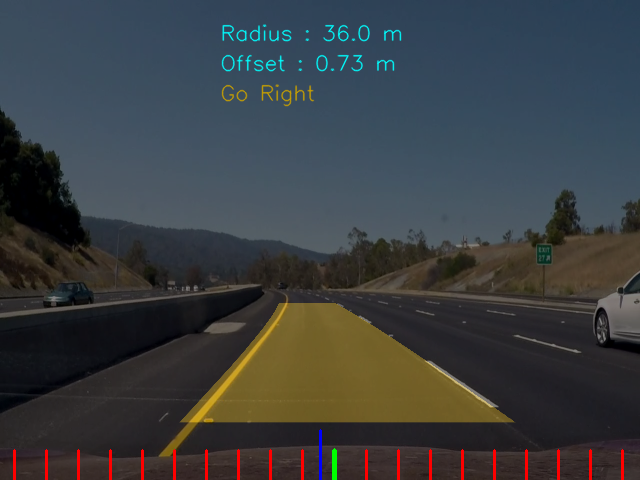

# Lane Detection using OpenCV
* This project will detect lanes in recorded video or via webcam.
* All the test videos are available in *assets/video* directory.
* Python version used - 3.6.10

## Required Python Packages

- OpenCV
- NumPy
- Matplotlib
- glob
- pickle

### How to Run:

1. Run create_calibration_pikle.py file to create calibration pickle file.
2. Edit define_constants.py file according to your needs. **If required**
3. Run lane_detection.py file.

## Output

 
*Canny Filter*
  

 
*Preprocessed Frame*
  

 
*Birdseye*
  

 
*Histogram Plot on Frame*
  

 
*Sliding Windows*
  

 
*Source Points*
  

 
*Lanes*
  

 
*Lanes with steering wheel*
  

#### Click on GIF to open video in YouTube

 
*Output when is_demo=True*

